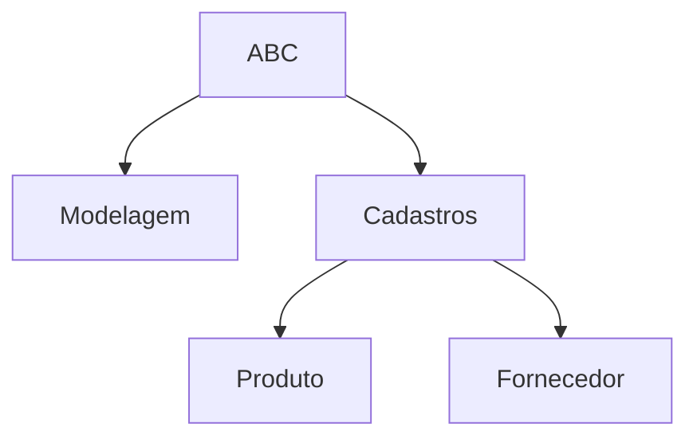

Escopo
coletar requisito
definir o requisito
fazer o EAP
EAP é a representação gráfica das principais atividades em formato de organograma organizacional de forma que represente uma hierarquia, mas o foco dele é identificar ou apresentar como será gerenciado o seu projeto.
Exemplos:
- Pode-se gerenciar uma equipe para desenvolver um programa dividindo as equipes por cadastros que serão usados no aplicativo:
	- Produtos; Uma equipe
	- Fornecedores: outra equipe
Outra forma:
- Uma equipe faz os cadastros em todos as telas, e outra faz relatórios
Ou por área geográfica: Uma em Piracicaba, outra em Dubai

## Gerenciamento de Cronograma
Gerenciamento de cronograma tem como processos principais:
- Estimar duração das atividades
- Sequenciar as atividades
- Elaborar o cronograma

O escopo faz parte do cronograma.

| ID | Descrição | Duração* | Predecessora | Sucessora | Mês 1 | Mês 2 | Mês 3 |
|--|--|:--:|:--:|:--:|:--:|:--:|:--:|
| 1 | Modelagem do DB | 1 | - | 3 | - |  |  |  |
| 3 | Cadastro Fornecedores | 1 | 1 | 4 |  | - | - |
| 4 | Cadastro Produtos | 2 | 3 | 8 |  |  |  |
| 8 | Testes | 1 | 4 | 10 |  |  |  |
| 10 | Implantação | 1 | 8 | - |  |  |  |
\* Meses

## Gerenciamento de Custos

 1. Estimar o Custo
 2. Determinar o Orçamento
 3. Controlar o Custo

> Deliverable: O que você vai entregar, quando e por quanto

### Gráfico de Orçamento Mensal / Acumulado

| ID | Atividade | COT* | 1 | 2 | 3 | 4 |
|--|--|--:|--|--|--|--|
| 81 |  | 10 | 5| | 5 |  |
| 02 |   | 5  | | 5 | | |
| 03 | | 20 | | | 10 | 10 |
| 04 | | 10 | | | | 10 |
| | Mês | 45 | 5 | 5 | 15 | 20|
| | Acum. | | 5 | 10 | 25 | 45 |
\* Custo Orçado Total em milhões de reais

### Gráfico Real Acumulado / Mensal

| ID | Atividade | CRT* | 1 | 2 | 3 | 4 |
|--|--|--:|--|--|--|--|
| 81 |  | 10 | 5| | 5 |  |
| 02 |   | 5  | | 5 | | |
| 03 | | 20 | | | 10 | 10 |
| 04 | | 10 | | | | 10 |
| | Mês | 45 | 5 | 5 | 15 | 20|
| | Acum. | | 5 | 10 | 25 | 45 |
\* Custo Real Total em milhões de reais

### Gráfico comparativo entre o orçado e o real

## Termo de Encerramento do Projeto (TEP)
É um documento textual que relata o encerramento.
> O projeto CJM, Casamento de João e Maria, encerrou-se com sucesso, dentro do prazo previsto. E o orçamento excedeu-se em 5%.

## Lista de documentos para o projeto
1. Termo de Abertura do Projeto
	- Logotipo
	- PMO
	- Sigla
	- Nome do Projeto
	- "Termo de Abertura do Projeto"
	- Versão
	- Conteúdo
		- Objetivo
2. Escopo / Atividades
	- Id, Título, Descrição breve, Responsável, Recursos materiais
3. Escopo EAP 
4. Cronograma / Atividades
5. Cronograma / Cronograma em si (pode ser junto com ativ)
6. Custos

N Termo de Encerramento do Projeto

<!--stackedit_data:
eyJoaXN0b3J5IjpbLTQ3MTM2MTYxNSwxMjEwMDY1NjQ0LC0yOT
c5MDM5NTUsODAyMDEyMDg3LC0xMTYyMTcxNjc3XX0=
-->