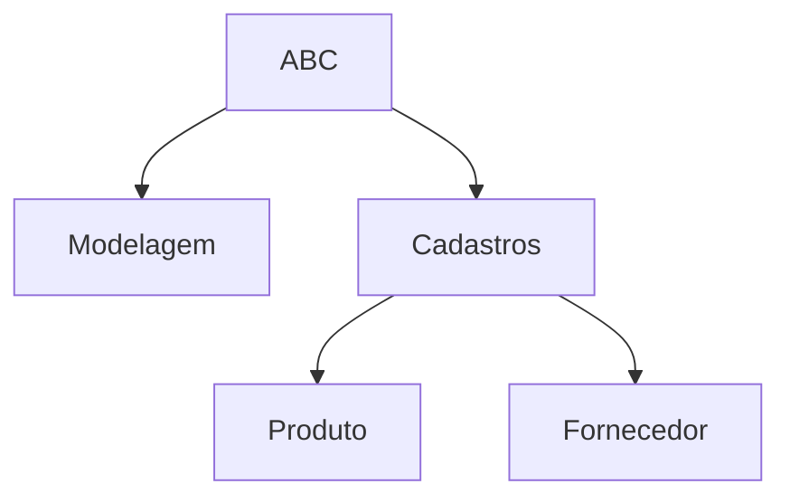
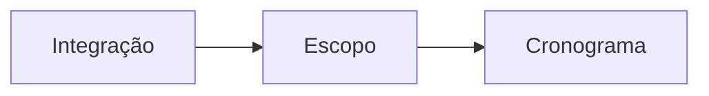

Escopo
coletar requisito
definir o requisito
fazer o EAP
EAP é a representação gráfica das principais atividades em formato de organograma organizacional de forma que represente uma hierarquia, mas o foco dele é identificar ou apresentar como será gerenciado o seu projeto.
Exemplos:
- Pode-se gerenciar uma equipe para desenvolver um programa dividindo as equipes por cadastros que serão usados no aplicativo:
	- Produtos; Uma equipe
	- Fornecedores: outra equipe
Outra forma:
- Uma equipe faz os cadastros em todos as telas, e outra faz relatórios
Ou por área geográfica: Uma em Piracicaba, outra em Dubai

## Gerenciamento de Cronograma
Gerenciamento de cronograma tem como processos principais:
- Estimar duração das atividades
- Sequenciar as atividades
- Elaborar o cronograma

O escopo faz parte do cronograma.

| ID | Descrição | Duração* | Predecessora | Sucessora | Mês 1 | Mês 2 | Mês 3 |
|--|--|:--:|:--:|:--:|:--:|:--:|:--:|
| 1 | Modelagem do DB | 1 | - | 3 | - |  |  |  |
| 3 | Cadastro Fornecedores | 1 | 1 | 4 |  | - | - |
| 4 | Cadastro Produtos | 2 | 3 | 8 |  |  |  |
| 8 | Testes | 1 | 4 | 10 |  |  |  |
| 10 | Implantação | 1 | 8 | - |  |  |  |
\* Meses

## Gerenciamento de Custos

 1. Estimar o Custo
 2. Determinar o Orçamento
 3. Controlar o Custo

> Deliverable: O que você vai entregar, quando e por quanto

| ID | Atividade | COT* | 1 | 2 | 3 | 4 |
|--|--|--:|--|--|0
| 81 |  | 10 |
| 82 |   | 5  |
| | | 20 |
| | | 10 |
| | | 45 |
\* Custo Orçado Total em milhões de reais
<!--stackedit_data:
eyJoaXN0b3J5IjpbNjM5NDk4OTUzLC0xMTYyMTcxNjc3XX0=
-->