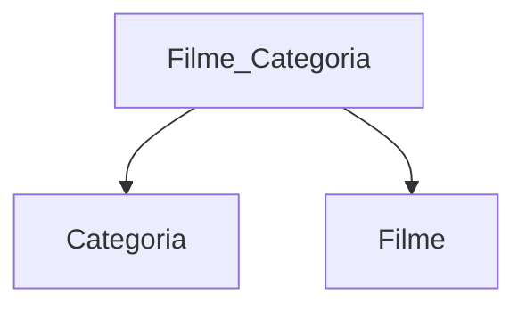

#### Ator
| ator_id |primeiro_nome  |
|--|--|
| 1 | Gustavo |
| 2 | João |
| 3 | Joana |
| 5 | Carlos |
| 7 | Xico |
| 9 | José |
---
#### Filme
| ator_id | filme_id |
|--|--|
| 1 | 1 |
| 3 | 1 |
| 5 | 1 |
| 1 | 2 |
| 7 | 2 |
| 1 | 3 |
| 5 | 3 |
| 7 | 5 |
| 10 | 6 |

----
#### Right Join
```sql
SELECT * FROM ator A
RIGHT JOIN filme_ator F ON A.ator_id = F.ator_id
```
| ator_id | primeiro_nome | ator_id | filme_id
|--|--|--|--|
| 1 | Gustavo | 1 | 1 |
| 3 | Joana | 3 | 1 |
| 5 | Carlos | 5 | 1 |
| 1 | Gustavo | 1 | 2 |
| 7 | Xico | 7 | 2 |
| 1 | Gustavo | 1 | 3 |
| 5 | Carlos | 5 | 3 |
| 7 | Xico | 7 | 5 |
| null | null | 10 | 6 |

----
#### Right Outer Join
```sql
SELECT * FROM ator A
RIGHT JOIN filme_ator F ON A.ator_id = F.ator_id
WHERE A.ator_id IS NULL
```
| ator_id | primeiro_nome | ator_id | filme_id
|--|--|--|--|
| null | null | 10 | 6 |

----
#### Inner Join
```sql
SELECT * FROM ator A
INNER JOIN filme_ator F ON A.ator_id = F.ator_id
```
| ator_id | primeiro_nome | ator_id | filme_id
|--|--|--|--|
| 1 | Gustavo | 1 | 1 |
| 3 | Joana | 3 | 1 |
| 5 | Carlos | 5 | 1 |
| 1 | Gustavo | 1 | 2 |
| 7 | Xico | 7 | 2 |
| 1 | Gustavo | 1 | 3 |
| 5 | Carlos | 5 | 3 |
| 7 | Xico | 7 | 5 |

---




```sql
SELECT F.titulo, FC.categoria_id
FROM filme F
LEFT JOIN filme_categoria FC ON F.filme_id = FC.filme_id
LEFT JOIN categoria C
```
<!--stackedit_data:
eyJoaXN0b3J5IjpbMTY2NjgyMTU2NiwxNTAwMDcxNzI3LC0xNz
I0Njg5MzM5LC0xNjUzMDg4MDQwXX0=
-->