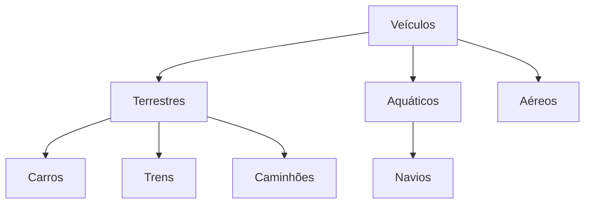

## Classes e Objetos
Classes são categorias de objetos. As classes definem e descrevem um grupo de objetos. Contem as definições, características, atributos e métodos que estão presentes nos objetos.
Por ser basicamente um conjunto de definições, as classes são consideradas modelos, moldes a partir do qual os objetos são construídos.
Os objetos são *instâncias* da classe, ou seja, manifestações físicas das definições descritas nas classes. Classes são abstratas, objetos são concretos.

## Métodos
Objetos realizam **ações**, mas estas ações precisam ser ativadas, iniciadas e eventualmente controladas. São os métodos que permitem a ativação ou controle dessas ações. Para cada ação é preciso existir um método.

## Hierarquia
Classes existem dentro de uma estrutura hierárquica com super-classes e subclasses.
Uma subclasse é uma especialização de sua superclasse.
Uma subclasse mantém todas as definições presentes em suas superclasse e acrescenta mais definições.


## Herança
Uma forma de ver a hierarquia das classes é dizer que a subclasse herda as definições de suas superclasses. Desse ponto de vista, subclasses são consideradas classes descendentes e as superclasses são chamadas de ancestrais.

# Java

### Tipos de Variáveis
- **int** - número inteiro com sinal de 32 bits
- **short** - número inteiro com sinal de 16 bits
- **long** - número inteiro com sinal de 64 bits
- **byte** - número inteiro com sinal de 8 bits
- **char** - caracter ou inteiro sem sinal de 16 bits
- **float** - número de ponto flutuante de precisão simples (32 bits)
- **double** - número de ponto flutuante de precisão dupla (64 bits)
- **boolean** - valor lógico ou binário (true ou false)

#### Exemplos:
```java
boolean b = true; // atribuindo verdadeiro
int a = 10;
b = a > 1; // atribuindo o resultado de uma expressão
```

#### Declaração de Classes em Java
```java
public class NomeClasse
{
	// Declaração de atributos
	// Construtores
	// Métodos
}
```
- **public**: indica que a classe é pública, ou seja, a classe é visível de qualquer ponto do programa. Caso o **public** seja omitido, então será uma classe de acesso padrão, visível apenas dentro do pacote (package) onde a classe está declarada.
- **pacote**: um conjunto de classes agrupadas por algum critério. Pacotes podem ser importados para a aplicação com o comando **import**.
- **class**: palavra reservada usada no Java para a declaração de classes.

#### Atributos
São dados relacionados ao objeto que a classe define. Representam suas características e estados.
Não confunda atributos com variáveis. Atributos são declarados fora de qualquer método e são sempre visíveis para a classe inteira. Variáveis são declaradas dentro dos métodos e só existem no método onde foram declaradas.

#### Níveis de acesso para atributos
**public**: Sem restrição de acesso
**omitido**: Acesso padrão. Só é acessível dentro do pacote onde a classe está declarada.
**private**: Só é visível para a própria classe.
**protected**: Visível dentro do pacote e para classes descendentes.

#### Exemplos:
```java
public class Aluno
{
	private String ra;
	public String nome;
	protected double media;
	...
}
```

#### Métodos
Ativam ou controlam as ações que o objeto realiza. A declaração de métodos é muito parecida com a de funções, com a diferença que métodos só existem dentro de classes.
Os métodos também estão sujeitos a algum nível de acesso. Os níveis de acesso para métodos são os mesmos que para atributos.

```java
public class Aluno
{
	private String ra;
	public String nome;
	protected double media;
	
	public void printNomeRa()
	{
		System.out.println(nome + ": " + ra);
	}
}
```

#### Getters e Setters
Atributos são sempre críticos para o bom funcionamento da classe. Um objeto que contenha valores inválidos em seus atributos não irá funcionar. Para garantir a validade dos atributos, a classe precisa ter participação na atribuição dos valores e ter a chance de fazer as validações necessárias. Isso não é possível em atributos públicos, já que podem ser acessados (e preenchidos) de fora da classe.
Então, é comum deixar os atributos sempre privados e oferecer métodos para acesso controlados aos atributos. São os **getters** e **setters**. **Getters** para recuperar o valor do atributo e o setter para modificar o valor.
O uso de **setters** para atribuir valores ao atributo permite que a classe possa fazer uma validação e eventualmente recusar uma atribuição inválida.

```java
public class Aluno
{
	private String ra;
	private String nome;
	private double media;
	
	public double getMedia()
	{
		return media;
	}
	
	public void setMedia(double valor)
	{
		if (valor >= 0 && valor <= 10)
		{
			media = valor;
		}
	}
	
	public void printNomeRa()
	{
		System.out.println(nome + ": " + ra);
	}
}
```
<!--stackedit_data:
eyJoaXN0b3J5IjpbLTgwNzUwODYyM119
-->