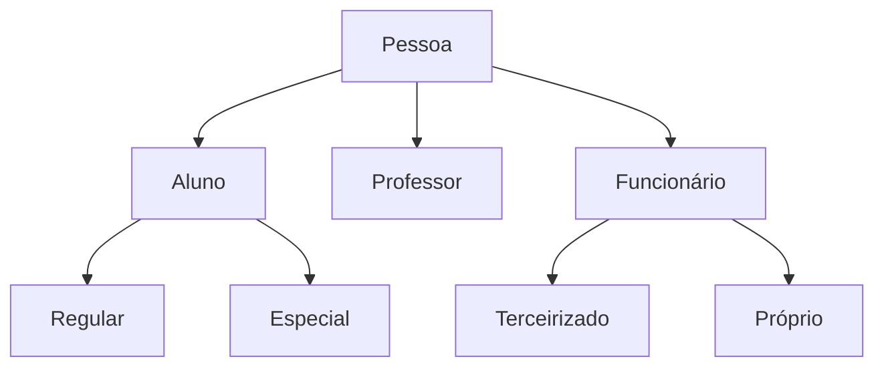

# Herança
Permite que uma classe herde recursos (atributos e métodos) de outra classe.
A nova classe (chamada classe descendente ou sub-classe), já inicia como todo o código implementado pela classe original (ancestral ou super-classe).
A classe descendente passa a ser um sub-tipo da classe ancestral. Uma instância (objeto) da classe ancestral. Uma instância (objeto) da classe descendente, também será instância da classe ancestral.

## Em Java
O Java usa a palavra reservada `extends` para indicar a relação de herança entre duas classes.

```java
public class Descendente extends Ancestral
{
	// Construtores, atributos
	// e métodos da classe descendente
}
```
### Classe Universitária

## Construtores
Construtores da classe ancestral não podem ser usados diretamente para construir objetos da classe descendente.
Cada classe precisa ter seu próprio conjunto de construtores (Java).
O Java exige também que cada construtor da classe descendente faça uma chamada a algum construtor da classe ancestral, antes de qualquer outro código.

### Referência `super`
É uma referência ao próprio objeto que existe em todos os objetos. A diferença entre `this` e o `super`, é que o `this` se refere sempre à própria classe e o `super` se refere à classe ancestral (super classe).
O `super` pode ser usado para acesso a atributos e métodos quando existe algum conflito de nomes e também para chamar construtores ancestrais a partir dos construtores descendentes.

```java
super(lista de parâmetros);
super.metodo();
```

### Acesso aos atributos
O modificador de acesso `protected` permite que a classe descendente tenha acesso público aos atributos e métodos marcados com esse nível de acesso, mas fora da classe funcionam como se fossem privados.

## Projeto Cartesiano
Nova classe: `Circulo`
Representa um circulo no plano cartesiano. O circulo é definido pelo ponto no centro e o raio.
Use a classe `Ponto` como ancestral para o centro do círculo e acrescente o atributo `raio` (double).

#### Construtores
**Padrão**: Cria o círculo na posição (0,0) e raio = 1.
**Com parâmetros**: Recebe as coordenadas do centro (x,y) e o comprimento do raio.
**Copy Constructor**: Copia os atributos de outro círculo já existente.

## Sobreposição
Ocorre quando a classe descendente reescreve um método que já existe na classe ancestral, usando exatamente a mesma assinatura.
Nesse caso a versão descendente do método se sobrepõe à versão ancestral. Um objeto criado a partir da classe descendente só terá acesso à nova versão do método.
No entanto, dentro da classe, ainda é possível acessar a versão ancestral usando a referência a `sup
<!--stackedit_data:
eyJoaXN0b3J5IjpbMzQwNDMzOTE0LDEwODE1NDk3ODQsLTUwNT
AwOTIzMCwtNDQ1Njg3NDAyLC0xODk4MTg4ODI5LDE0OTg4MzMz
MjYsLTE4NDIwMDE3MDAsMTE3MjE5Mzk5NywtMTkwNzg1NjU0MC
wxMDI4MTg2NTM1LDEzMTE4NDIwM119
-->