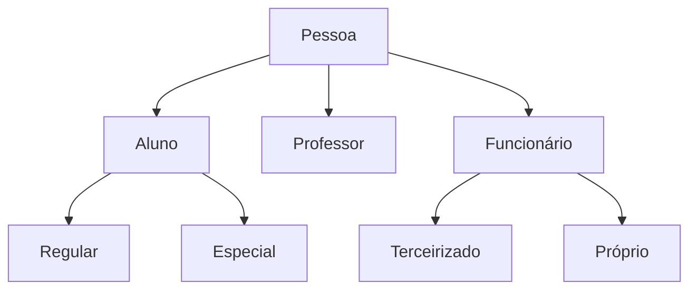

# Herança
Permite que uma classe herde recursos (atributos e métodos) de outra classe.
A nova classe (chamada classe descendente ou sub-classe), já inicia como todo o código implementado pela classe original (ancestral ou super-classe).
A classe descendente passa a ser um sub-tipo da classe ancestral. Uma instância (objeto) da classe ancestral. Uma instância (objeto) da classe descendente, também será instância da classe ancestral.

## Em Java
O Java usa a palavra reservada `extends` para indicar a relação de herança entre duas classes.

```java
public class Descendente extends Ancestral
{
	// Construtores, atributos
	// e métodos da classe descendente
}
```
### Classe Universitária

## Construtores
Construtores da classe ancestral não podem ser usados diretamente para construir objetos da classe descendente.
Cada classe precisa ter seu próprio conjunto de construtores (Java).
O Java exige também que cada construtor da classe descendente faça uma chamada a algum construtor da classe ancestral, antes de qualquer outro código.
<!--stackedit_data:
eyJoaXN0b3J5IjpbMTQ5ODgzMzMyNiwtMTg0MjAwMTcwMCwxMT
cyMTkzOTk3LC0xOTA3ODU2NTQwLDEwMjgxODY1MzUsMTMxMTg0
MjAzXX0=
-->