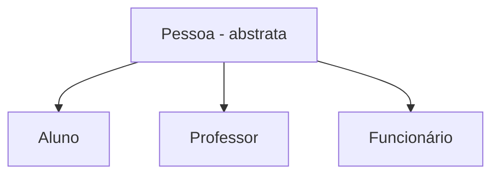

# Classes Abstratas

São classes consideradas genéricas demais para permitir a criação de objetos. Ou a classe não tem definições suficientes, ou suas instâncias não fazem sentido dentro dos sistemas. Servem apenas para serem ancestrais de outras classes.
Em Java, a classes é declarada abstrata acrescentando a palavra reservada `abstract` na declaração da classe.
Uma vez declarada abstrata, a classe não poderá ser diretamente instanciada.

```java
public abstract class NomeClasse
{
	// atributos
	// construtores
	// métodos
}
```



<!--stackedit_data:
eyJoaXN0b3J5IjpbMTM5NDAwNzA5NF19
-->