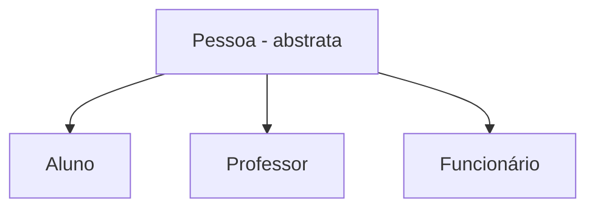

# Classes Abstratas

São classes consideradas genéricas demais para permitir a criação de objetos. Ou a classe não tem definições suficientes, ou suas instâncias não fazem sentido dentro dos sistemas. Servem apenas para serem ancestrais de outras classes.
Em Java, a classes é declarada abstrata acrescentando a palavra reservada `abstract` na declaração da classe.
Uma vez declarada abstrata, a classe não poderá ser diretamente instanciada.

```java
public abstract class NomeClasse
{
	// atributos
	// construtores
	// métodos
}
```


## Métodos abstratos

São métodos que são declarados na classe, mas não são implementados. Têm apenas assinatura, mas não tem código. O código será implementado por alguma classe independente.
Métodos abstratos só podem ser declarados em classes abstratas.
As classes descendentes herdam também a obrigação de implementar os métodos abstratos. Caso a classe descendente não possa implementar algum método, deve também ser declarada abstrata e delegar a implementação para alguma classe descendente.
Em Java, um método é declarado abstrato colocando `abstract` antes do tipo de retorno do método e encerrando a declaração com um `;`

```java
public abstract void metodo();
```

A implementação na classe descendente é na verdade uma sobreposição do método.

```java
@Override
public void metodo()
{
	// código
}
```


<!--stackedit_data:
eyJoaXN0b3J5IjpbMTIyNTg1MTQxNiw3NzQ3MjAwNTYsLTkwMz
kzOTY4NywtMTc0MzYxOTg1OF19
-->