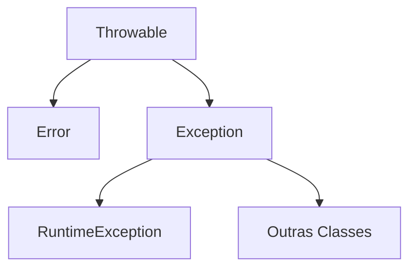

# Exceções

São criadas quando uma situação inválida é detectada. Uma vez criada, é lançada na pilha de execução (`stack`).
As funções que estão na pilha recebem a exceção e podem capturá-la ou não. Caso não capturem a função é abortada e a exceção passa para a próxima função. Esse processo continua até que a exceção seja capturada ou até chegar à função `main`. Se não for capturada na função `main`, ela também é abortada e o programa encerrado.

## Pilha de execução (`stack`)

É uma área de memória reservada para uso das funções que estão em execução.

### Heap
O Heap, ou área de alocação dinâmica, é um espaço reservado para variáveis e dados criados durante a execução do programa (runtime). Vamos dizer que o Heap é a memória global do programa.

### Stack
A pilha de funções é uma área da memória que aloca dados/variáveis ou ponteiros quando uma função é chamada e desalocada quando a função termina. Podemos dizer então que representa a memória local àquela função.

[https://blog.pantuza.com/artigos/heap-vs-stack](https://blog.pantuza.com/artigos/heap-vs-stack)

## Estrutura Try-Catch-Finally

Usada para capturar exceções.
No bloco `try` é colocado o código que será protegido. Este código é executado até o ponto onde a exceção ocorreu.
Se ocorreu uma exceção, os blocos `catch` são verificados até encontrar um que combine com a exceção ocorrida. O código do bloco será então executado.
O código do bloco `finally` é sempre executado, ocorrendo ou não a exceção. Use para finalizar operações que não podem ficar pendentes.

```java
try {
	...
} catch(ClasseExceção1 inst) {
	...
} catch(ClasseExceção2 inst) {
	...
} finally {
	...
}
```

## Classes de Exceções

Todas as classes de exceções são descendentes da classe `Exception`. Portanto todas as exceções são instâncias de `Exception`.
Caso a classe `Exception` seja usada em um bloco `catch`, deve ser o último bloco da lista, porque esta combina com qualquer exceção.

## Hierarquia de Exceções

### `Throwable`
Permite o lançamento na pilha de execução.
Tem duas classes descendentes:
**Error**: Geralmente usado para erros de hardware (mais graves). Não é aconselhável capturar erros. Melhor deixar acontecer para que o usuário receba o aviso e tome providências.
**Exception**: Classe raiz de todas as exceções.
**RuntimeException**: Descendente de Exception, esta classe é usada para exceções menos graves, chamadas de `unchecked` (não verificadas).

Classes que são dependentes de `Exception` mas não de `RuntimeException` são chamadas de `checked`.



## Lançamento de Exceções

Quando uma situação de erro é detectada, é possível criar e lançar uma exceção na pilha de execução para avisar as outras funções da situação de erro.
Para isso, basta criar uma instância da exceção correspondente e em seguida lançar a exceção na pilha usando o comando `throw`. Nada mais será executado após o lançamento da exceção até que ela seja capturada.

### Exceções Verificadas (`checked`)
O método que lança uma exceção verificada precisa avisar em sua assinatura  que pode lançar a exceção com o comando `throws`.
Este método só poderá ser chamado dentro de um bloco `try`.

Exemplo:
<!--stackedit_data:
eyJoaXN0b3J5IjpbMTA0NDQ4NjE4MCwtMTQxNzg2Mjc4MiwtMj
E2MjMzMzE5LDEwODI4MjYyNTgsLTUwMjYwNTUxOF19
-->