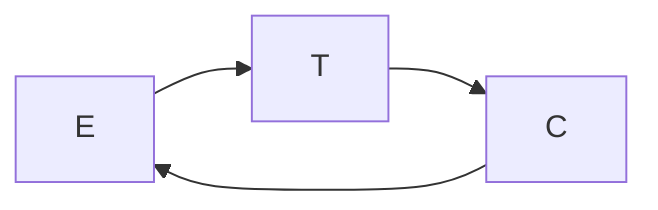

## Projeto
Esforço temporário para alcançar um **produto** ou **serviço**.

#### Etapas de um projeto
- Iniciação
- Planejamento
- Monitoramento e controle
- Execução
- Encerramento

## Por qual motivo abre-se um projeto
- Demanda do mercado
- Oportunidade de negócio
- Consideração ambiental
- Avanço tecnológico
- Requisito legal
<!--stackedit_data:
eyJoaXN0b3J5IjpbLTEyMzA1NzgwOThdfQ==
-->